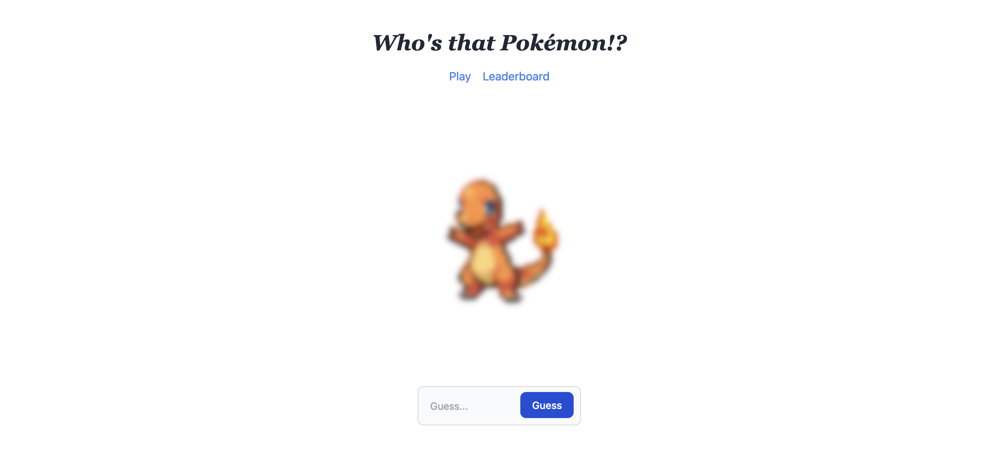

### Who's that Pokémon!?

Pretty basic who's that pokemon using the pokemon api, stores fetched pokemon into a database to serve cached results, store the counts of guesses in a leaderboard.

Quick and dirty little project

Todo:

- [ ] Add tests.
- [ ] Clean up the views

